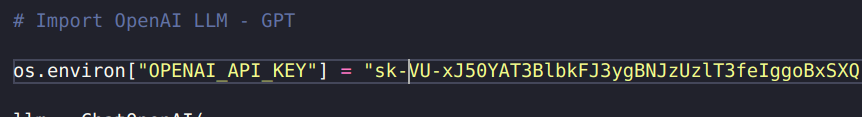
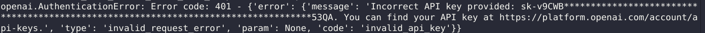

# Stack used


### Outras ferramentas:
- [OpenAI](https://openai.com/)
- [pip](https://pypi.org/project/pip/)
- [asdf](https://asdf-vm.com/)


## Authors
- [Me](https://www.linkedin.com/in/devfandre/)
- [Rocketseat](https://www.rocketseat.com.br)


## Create virtual enviroment

``` 
python -m venv venv
``` 

## Activate virtual enviroment

``` 
 source .venv/bin/activate
``` 

## Install dependencies

``` 
 pip install -r webappStocks/requirements.txt
``` 


## Change your API KEY URL from OpenAI

#### Note: You need to credits in your account to use this model, because the model 3.5-turbo is need a credits.




## Streamlit server

``` 
streamlit run crewai-stocks.py
``` 

Open the http://localhost:8501/ and select your ticket


## :mailbox_with_no_mail: Contatos

E-mail: profissionalf.andre@gmail.com<br>
Linkedin: https://www.linkedin.com/in/devfandre/<br>


# Common errors

#### 401 OpenAI


**Solution**: Please, provide a correct API key (with credits) in OpenAI